SPLOTCH
=======

Simple PLOTs, Contours and Histograms is a small package with wrapper functions designed to facilitate simplified, concise calls to matplotlib plotting.
~~~~~~~~~~~~~~~~~~~~~~~~~~~~~~~~~~~~~~~~~~~~~~~~~~~~~~~~~~~~~~~~~~~~~~~~~~~~~~~~~~~~~~~~~~~~~~~~~~~~~~~~~~~~~~~~~~~~~~~~~~~~~~~~~~~~~~~~~~~~~~~~~~~~~~~~

 The general mantra of SPLOTCH is that plotting calls should require
only a single line of code to manifest rather than requiring the user to
manually specify each aspect of a plot individually
(e.g. axes.set_xlim(), axes.set_title(), axes.set_xlabel(), etc.).
SPLOTCH is designed to be a superset of matplotlib.pyplot, given you all
the functionality that already exists, plus some useful, intuitive
shortcuts.

Basic Plots
-----------

Simple plot using matplotlib
~~~~~~~~~~~~~~~~~~~~~~~~~~~~

The simplest plot one can make is a series of y data against some x
data. Producing this in ``matplotlib`` might look something like the
following.

.. code:: ipython3

    # Import some standard libraries
    import numpy as np
    # Import matplotlib
    import matplotlib.pyplot as plt
    
    import matplotlib
    matplotlib.rcParams['figure.facecolor'] = 'white' # my own fudge for notebooks :/

.. code:: ipython3

    # Create some fake data
    xdata = np.linspace(0.0,10.0,num=200) + np.random.random(size=200)/10.0
    ydata = xdata**3 - 8*xdata**2 + np.random.normal(0.0,20.0,size=200)
    cdata = 3*np.sin(xdata*2) + 0.2*abs(ydata)

.. code:: ipython3

    fig, ax = plt.subplots()
    
    #####  MATPLOTLIB USAGE  #####
    #--------------------------------------------------------#
    ax.plot(xdata,ydata)
    
    ax.set_xlabel("x data")
    ax.set_ylabel("y data")
    ax.set_title("A Simple Plot")
    
    ax.grid(True)
    #--------------------------------------------------------#
    
    plt.show()

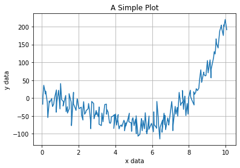

Now, using SPLOTCH
~~~~~~~~~~~~~~~~~~

We can replicate the above matplotlib plot in just a single call to
SPLOTCH. ###### Same outcome … just one line.

.. code:: ipython3

    # import SPLOTCH
    import splotch as splt

.. code:: ipython3

    fig, ax = plt.subplots()
    
    #####  SPLOTCH USAGE  #####
    #--------------------------------------------------------#
    splt.plot(xdata,ydata,xlabel="x data",ylabel="y data",title="A Simple Plot",grid=True)
    #--------------------------------------------------------#
    
    plt.show()

.. image:: output_7_0.png

Basic histograms
----------------

The same goes for producing basic 1D histograms with SPLOTCH - one line
is all it takes. There are also some useful ways to assign binning of
the histrogram.

.. code:: ipython3

    # Create an array with some random distribution
    data = np.append(np.random.normal(5.0,2.5,size=1000), np.random.normal(10.0,0.5,size=1000))

.. code:: ipython3

    fig, (axes1, axes2) = plt.subplots(ncols=2,nrows=1,figsize=(10,3))
    
    
    #####  MATPLOTLIB USAGE  #####
    #--------------------------------------------------------#
    axes1.hist(data,bins=30,density=True,histtype='step')
    
    axes1.set_xlim(-5,14)
    axes1.set_ylim(0,0.5)
    
    axes1.grid(True)
    axes1.set_xlabel("Some Data")
    axes1.set_ylabel("Normalised Counts")
    axes1.set_title("matplotlib.pyplot usage")
    #--------------------------------------------------------#
    
    
    #####  SPLOTCH USAGE  #####
    #--------------------------------------------------------#
    splt.hist(data,bins=30,ax=axes2,xlim=(-5,14),ylim=(0,0.5),dens=True,
              xlabel="Some Data",ylabel="Normalised Counts",title="SPLOTCH usage",grid=True)
    #--------------------------------------------------------#
    
    plt.show()

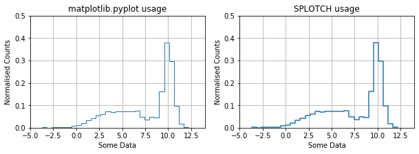

2D Images and Colourbars
------------------------

SPLOTCH has a fairly simple wrapper around the currently available
``pyplot.imshow()`` (or ``plt.matshow()``) function but with some
additional useful utilities. Colour bars can be tedious to create in
standard matplotlib usage as they must be done after-the-fact. In
SPLOTCH, you can turn on colour bars within most 2D functions simply by
setting ``clabel`` and can also make use of paramters such as ``clog``,
``clim``, ``cmap``, ``cbar_invert``, etc.

.. code:: ipython3

    ### Create an image of a 2D Gaussian
    X, Y = np.meshgrid(np.linspace(-1,1,25),np.linspace(-1,1,25))
    img = 5*np.exp(-((X)**2+(Y)**2)/2.0 * 2.0**2)

.. code:: ipython3

    fig, axes = plt.subplots(figsize=(8,6))
    
    splt.img(img,clim=(2,5),cbar_invert=True,cmap="magma",
             xlabel="x [pixels]",ylabel="y [pixels]",clabel="$z = e^{-(x^2 + y^2)\\sigma^2/2}$")
    
    plt.show()

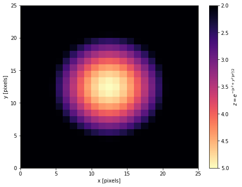

2D histograms and contours
--------------------------

With SPLOTCH, binning two-dimensional data to produce density
distributions or calculating statistics (means, medians, etc.)
simultaneously across two axes has never been easier! Simply using the
``splotch.hist2D`` or ``splotch.sigma_cont`` will provide all the
necessary functionality of working with data in two-dimensions.

.. code:: ipython3

    # Create some data representing two multi-variate 2D Gaussians
    num = 10000
    xvals, yvals = np.append(np.random.multivariate_normal([5,10],[[2,1],[1,2]],size=num//2).T,
                             np.random.multivariate_normal([8,6],[[2,0],[0,2]],size=num//2).T,axis=1) 
    cvals = xvals+yvals

.. code:: ipython3

    fig, axes = plt.subplots(nrows=3,ncols=1,figsize=(6,14))
    
    # A set number of bins across both axes
    splt.hist2D(xvals, yvals, xlim=(0,12), ylim=(0,16), bins=50, 
                xlabel="x data",ylabel="y data",clabel="Number density",
                title="Set Number of Bins",ax=axes[0])
    
    # Different numbers of bins for each axis
    splt.hist2D(xvals, yvals, xlim=(0,12), ylim=(0,16), dens=False, bins=[20,75],
                xlabel="x data",ylabel="y data",clabel="Number count",
                title="Variable Number of Bins",
                cmap='gray',ax=axes[1])
    
    # Array defining arbitrarily-spaced bin edges (e.g. logarithmic below)
    splt.hist2D(xvals, yvals, c=cvals, xlim=(1,20), ylim=(1,20), dens=False,
                bins=np.logspace(-1,2,num=75),clog=True,xlog=True,ylog=True,cstat='mean',
                xlabel="x data",ylabel="y data",clabel="mean values",
                title="Logarithmically-Spaced Bin Edges",cmap='RdYlBu_r',ax=axes[2])
    
    fig.tight_layout()
    plt.show()

.. image:: output_16_0.png

SPLOTCH-specific plots
======================

SPLOTCH, as well as adding convenience wrappers around various
matplotlib.pyplot functions, also has a series of its own plotting
functions for various uses. These include, percentile contours, sector
plots, broken axes, etc.

Contour Plots
-------------

Here is the SPLOTCH percentile contours function which, given some x and
y data, will create contours around specified percentiles of the
two-dimensional distribution.

.. code:: ipython3

    fig, axes = plt.subplots(figsize=(8,5))
    
    splt.contourp(xvals,yvals,percent=[68.3,95.5,99.7],bins=[20,15],lab_loc=2,
                    xinvert=True,yinvert=False,xlim=(0,16),ylim=(0,16),
                    xlabel="x data (inverted)",ylabel="y data")
    
    plt.show()

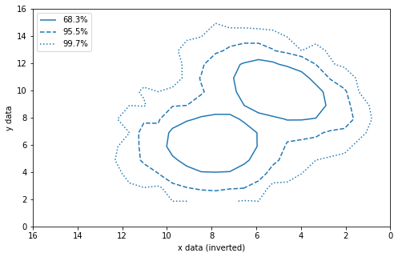

Sector Plots
------------

Sector plots (a.k.a. “pizza slice” plots) are useful for plotting the
spatial distribution of data containing one radial axis (r) and another
corresponding to the angle (theta).

.. code:: ipython3

    thetaArr = np.random.uniform(low=30.0,high=150.0,size=1000)
    rArr = np.random.gamma(shape=2.0,scale=0.3,size=1000)
    cArr = 9.0 + rArr*5 + np.random.normal(0.0,2.0,size=1000)

.. code:: ipython3

    ## Basic sector plot defining the theta and radial limits
    fig = plt.figure()
    splt.sector(theta=thetaArr,r=rArr,thetalim=(0.0,150.0),rlim=(0.0,3.0),
                rlabel="distance",thetalabel="RA")
    
    ## Sector plots are treated as a scatter plot so the user can parse any `scatter()` specific into sector()
    fig = plt.figure()
    splt.sector(theta=thetaArr,r=rArr,thetalim=(20.0,180.0),rlim=(0.75,3.5),
                rlabel="distance",thetalabel="RA",
                c=cArr,edgecolor='black',marker='s',s=25*rArr**0.8)
    
    ## As well as defining the limits of the theta arr, one can define the rotation of the entore sector
    fig = plt.figure()
    splt.sector(theta=thetaArr,r=rArr,thetalim=(20.0,160.0),rlim=(0.0,3.0),
                rlabel="distance",thetalabel="RA",rotate=90.0,
                c=cArr,edgecolor='black',marker='s',s=25*rArr**0.8)
    
    plt.show()

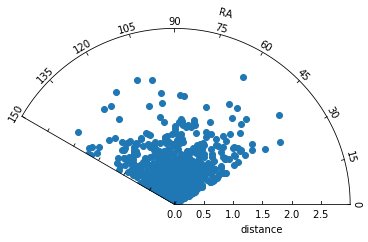

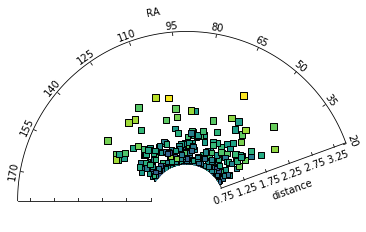

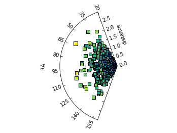

Broken axis plots
-----------------

Sometimes you wish to plot some data that has a discontinuity at some
point but to plot it on one axis would stretch the limits of the axis.
Instead, placing a break in the plot can shw both regions of the data
without sacrificing the stretch on the limits.

.. code:: ipython3

    xbroken = np.append(np.arange(0.0,1.0,step=0.02), np.arange(20.0,30.0,step=0.02))
    ybroken = xbroken**0.5 + np.random.normal(1.0,0.2,size=len(xbroken))

.. code:: ipython3

    fig, axes = splt.subplots(ncols=2,wspace=0.5)
    
    splt.plot(xbroken,ybroken,ax=axes[0],
              xlabel='Broken x data',ylabel="y data",
              linestyle='',marker='o',mec='black')
    
    splt.brokenplot(xbroken,ybroken,ax=axes[1],xbreak=[1.5,19.5],
                    xlabel='Broken x data',ylabel="y data",
                    linestyle='',marker='o',mec='black')
    
    plt.show()

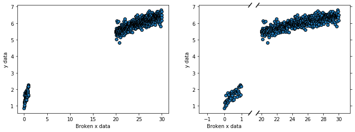

Figure Subplots
===============

Basics
~~~~~~

The usage subplots within matplotlib is already sufficient to easily
create an NxM grid of axis panels within a figure using the
``plt.subplots()`` function. However, when one wishes to create a set of
axes that cannot be represented in the usual NxM layout (e.g. naxes=7),
your options are limited. One can instead use the SPLOTCH ``subplots()``
which, as well as having the base N rows x M cols usage, can allow you
to specify an arbitrary number of axes.

Here’s how the ``naxes`` feature looks in practice:

.. code:: ipython3

    fig, axes = splt.subplots(naxes=7,figsize=(9,4),facecolor='lightblue')
    plt.show()

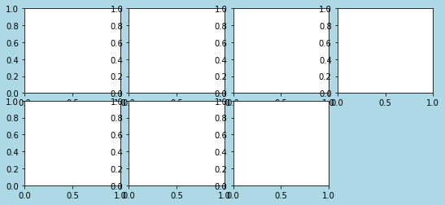

Axis alignments with splotch.subplots()
~~~~~~~~~~~~~~~~~~~~~~~~~~~~~~~~~~~~~~~

In the case of ``naxes=7``, there are various configurations for this
particular 2x4 grid that one could imagine placing the 7 axes within.
This functionality is controlled using the ``ha`` (horizontal alignment)
and ``va`` (vertical alignment) parameters. ``ha`` accepts ‘left’,
‘right’ and ‘centre’, whereas ``va`` accepts ‘top’, ‘bottom’ and
‘middle’.

Here are a few examples of axis alignments:

.. code:: ipython3

    # horizontal alignment: left;  vertical alignment: top (Defaults)
    fig, axes = splt.subplots(naxes=7,ha='left',va='top',figsize=(9,4),hspace=1,wspace=1,facecolor='lightblue')  
    fig.suptitle("ha = left, va = top",fontsize=26,y=1.05)
    for ii in range(len(axes)): axes[ii].text(0.45,0.45,ii,fontsize=22)
    
    # horizontal alignment: right;  vertical alignment: bottom
    fig, axes = splt.subplots(naxes=7,ha='right',va='bottom',figsize=(9,4),hspace=1,wspace=1,facecolor='lightblue') 
    fig.suptitle("ha = right, va = bottom",fontsize=26,y=1.05)
    for ii in range(len(axes)): axes[ii].text(0.45,0.45,ii,fontsize=22)
    
    # horizontal alignment: centre;  vertical alignment: bottom (with two columns)
    fig, axes = splt.subplots(naxes=7,ncols=2,ha='left',va='centre',figsize=(4,9),hspace=1,wspace=1,facecolor='lightblue') 
    fig.suptitle("ha = left, va = centre",fontsize=26)
    for ii in range(len(axes)): axes[ii].text(0.45,0.45,ii,fontsize=22)
    
    plt.show()

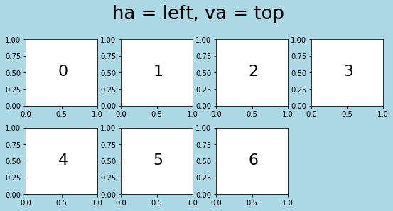

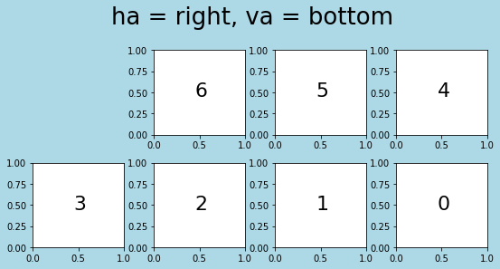

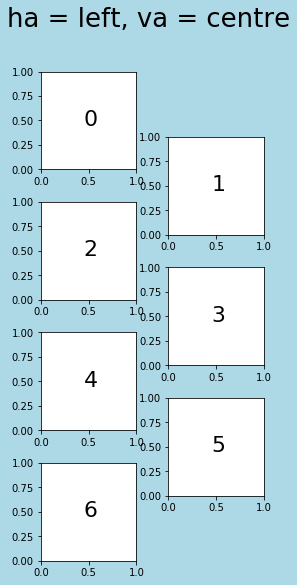

Notes on splotch.subplots()
~~~~~~~~~~~~~~~~~~~~~~~~~~~

Note that the alignments chosen also impact the order in which each axis
instance are arranged within the ``axes`` array that is returned. Whilst
the user can specify any combination of ``naxes``, ``nrows`` and
``ncols``, the function will raise an exception if
``nrows*ncols != naxes``. The only combination of ``ha`` and ``va`` not
allowed is where both are ‘centre’.

Working with Text in SPLOTCH
============================

Text within plots is itself its own separate element and as such SPLOTCH
provides the ``adjust_text()`` function to control it. This function can
make one (or many) choices of text instances to change the text
properties for. Currently, the available text instance specified using
``which`` are: \* ‘x’\|‘xlabel’ : x-axis label \* ‘y’\|‘ylabel’ : y-axis
label \* ‘t’\|‘title’ : Title \* ‘s’\|‘suptitle’ : Super-title (Not
implemented) \* ‘l’\|‘legend’ : Legend text \* ‘c’\|‘colorbar’ : Color
bar (Limited to a single colorbar) \* ‘T’\|‘text’ : Text objects \*
‘a’\|‘all’ : All instances of all the above

.. code:: ipython3

    # Create some data representing two multi-variate 2D Gaussians
    num = 10000
    xvals, yvals = np.random.multivariate_normal([5,10],[[2,1],[1,2]],size=num//2).T
    
    fig, axes = plt.subplots(nrows=1,ncols=2,figsize=(16,6))
    
    splt.hist2D(xvals, yvals, xlim=(0,10), ylim=(5,15), bins=50, 
                xlabel="x data",ylabel="y data",clabel="Number density",title="2D Histogram",
                ax=axes[0])
    
    splt.contourp(xvals,yvals,percent=[68.3,95.5,99.7],bins=[20,20],lab_loc=1,
                    xlim=(0,10), ylim=(5,15),xlabel="x data",ylabel="y data",title="Contour Plot",
                    ax=axes[1])
    
    text1 = axes[0].text(0,14,"This is a piece of text!")
    text2 = axes[0].text(0,13,"This is another piece of text!")
    text3 = axes[0].text(0,12,"This is the final piece of text!")
    
    text4 = axes[0].text(9,6,"Look at me, I am some text!",ha='right')
    
    # Adjust x and y labels on all axes
    splt.adjust_text(['x','y'],fontsize=22,color='red',alpha=0.5,ax=axes)
    
    # Adjust title font on only one axis
    splt.adjust_text('t',fontsize=26,ax=axes,color='darkblue')
    
    # Adjust colorbar font
    splt.adjust_text('c',fontsize=20,fontstyle='italic',fontvariant='small-caps',
                     horizontalalignment='right')
    
    # Adjust labels in legend
    splt.adjust_text('l',fontsize=20,color='purple',backgroundcolor='lightgrey',ax=axes[1])
    
    # Adjust all text instances in an axis.
    splt.adjust_text('T',fontsize=20,color='limegreen',ax=axes[0])
    
    #... or adjust a specific Text object
    splt.adjust_text(text4,fontsize=22,color='goldenrod',backgroundcolor='black',ax=axes[0])
    
    # All of the above could be achieved in a single-line if desired
    #splt.adjust_text(['x','y','t','c','l','T',text4],fontsize=[22,22,26,20,20,20,22],
    #                 color=['red','red','darkblue','black','black','green','goldenrod'],ax=axes)
    
    fig.tight_layout()
    plt.show()

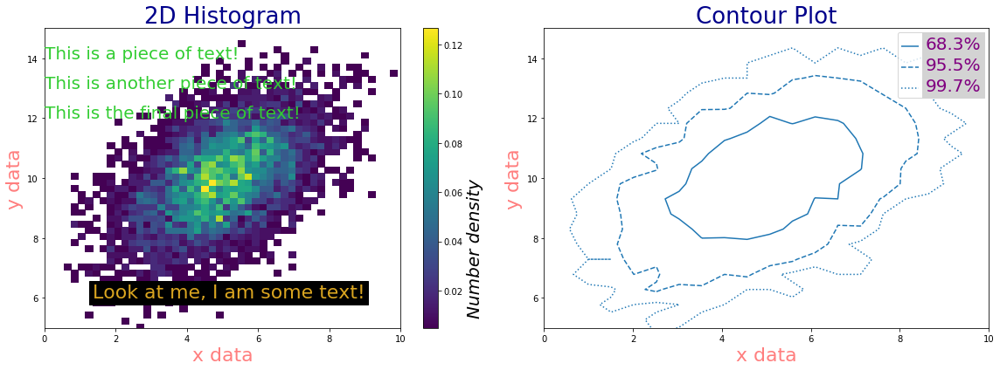

Using plot_kw and \**kwargs One of the core features of SPLOTCH is that it is a wrapper around matplotlib.pyplot so the user has access to not only the SLOTCH-specific parameters (e.g. ``xlabel``, ``title``, ``grid``, etc.), they may also access all underlying pyplot parameters by using keyword arguments (kwargs). One can use the ``plot_kw`` parameter to parse a dictionary of ``pyplot`` specific arguments that will be fed into the corresponding matplotlib plotting function. Alternatively, simply specifying the parameters as they are named within pyplot functions will be clump them together into a kwargs dictionary that acts the same as ``plot_kw``.
--------------------------------------------------------------------------------------------------------------------------------------------------------------------------------------------------------------------------------------------------------------------------------------------------------------------------------------------------------------------------------------------------------------------------------------------------------------------------------------------------------------------------------------------------------------------------------------------------------------------------------------------------------------------------------

.. code:: ipython3

    fig, axes = plt.subplots(nrows=1,ncols=2,figsize=(16,6))
    
    # Basic plot explicitly using plot_kw dictionary
    kw_dict = dict(marker='o',markersize=10,markerfacecolor='cyan',
                   markeredgecolor='darkgreen',color='black',alpha=0.8)
    
    # feed kw_dict into any splotch function
    splt.plot(x=xdata,y=ydata,xlog=True,ax=axes[0],
              xlabel="x data",ylabel="y data",title="Using plot_kw dictionary",
              plot_kw=kw_dict)
    
    
    # Basic plot *implicitly* referencing pyplot parameters which will be given as keyword arguments
    splt.plot(x=xdata,y=ydata,xlog=True,ax=axes[1],
              xlabel="x data",ylabel="y data",title="Using **kwargs",
              marker='s',markersize=6,markerfacecolor='black',markeredgecolor='red',color='goldenrod',alpha=1)
    
    plt.show()

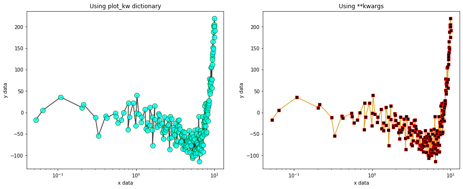

A complex plot using \**kwargs The full potential of using kwargs to specify plotting parameters can be seen in the example scatterplot below.
~~~~~~~~~~~~~~~~~~~~~~~~~~~~~~~~~~~~~~~~~~~~~~~~~~~~~~~~~~~~~~~~~~~~~~~~~~~~~~~~~~~~~~~~~~~~~~~~~~~~~~~~~~~~~~~~~~~~~~~~~~~~~~~~~~~~~~~~~~~~~~

.. code:: ipython3

    fig, axes = plt.subplots(figsize=(9,6))
    
    ### Using unnecessarily many kwargs to make a plot.
    splt.scatter(x=xdata,y=ydata,c=cdata,cmap='jet',vmin=0,vmax=15,plabel="A label",
                 xlabel="x data",ylabel="y data",clabel='colour',title="A complex plot",
                 s=150, marker='D', edgecolors='black',linewidths=2,hatch='//////',
                 alpha=0.75,plotnonfinite=True)
    
    plt.show()

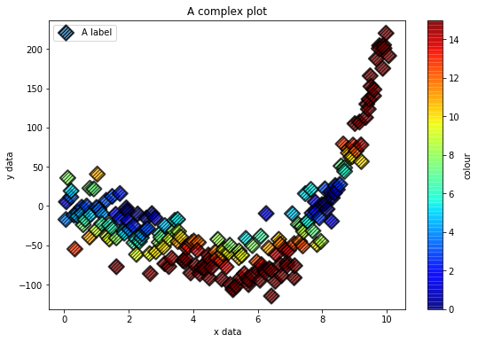

